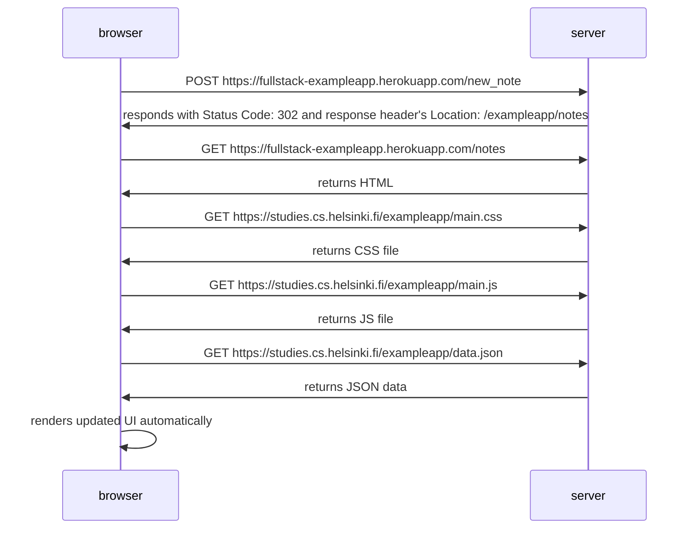

```mermaid
sequenceDiagram
    participant browser
    participant server

    browser->>server: POST https://fullstack-exampleapp.herokuapp.com/new_note
    server->>browser: responds with Status Code: 302 and response header's Location: /exampleapp/notes
    browser->>server: GET https://fullstack-exampleapp.herokuapp.com/notes
    server->>browser: returns HTML
    browser->>server: GET https://studies.cs.helsinki.fi/exampleapp/main.css
    server->>browser: returns CSS file
    browser->>server: GET https://studies.cs.helsinki.fi/exampleapp/main.js
    server->>browser: returns JS file
    browser->>server: GET https://studies.cs.helsinki.fi/exampleapp/data.json
    server->>browser: returns JSON data
    browser->>browser: renders updated UI automatically
```
