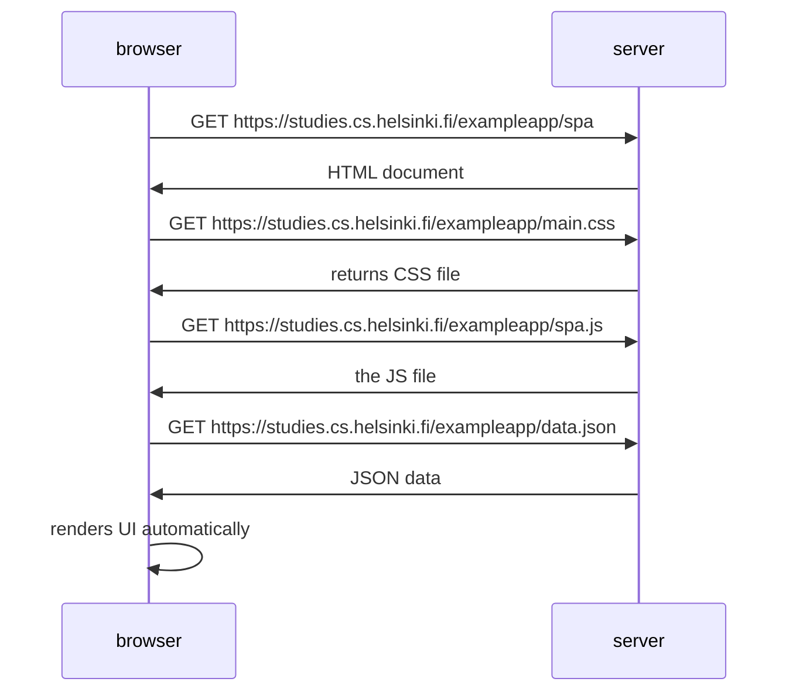

```mermaid
sequenceDiagram
    participant browser
    participant server

    browser->>server: GET https://studies.cs.helsinki.fi/exampleapp/spa
    server->>browser: HTML document
    browser->>server: GET https://studies.cs.helsinki.fi/exampleapp/main.css
    server->>browser: returns CSS file
    browser->>server: GET https://studies.cs.helsinki.fi/exampleapp/spa.js
    server->>browser: the JS file
    browser->>server: GET https://studies.cs.helsinki.fi/exampleapp/data.json
    server->>browser: JSON data
    browser->>browser: renders UI automatically
```
